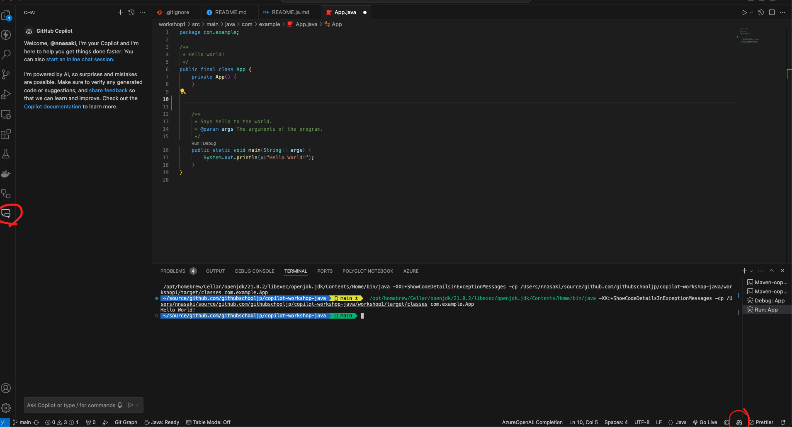

# Copilot와 함께하는 Python 워크샵

## 사전 준비 사항
다음의 환경을 준비해 주세요. 우리는 macOS 14.4.1과 Windows11에서의 작동을 확인했습니다. 연습은 Visual Studio Code에서 진행됩니다. GitHub Copilot를 지원하는 다른 IDE로 참여할 수 있지만, 우리가 답변할 수 없는 질문이 있을 수 있습니다.

- [Python](https://www.python.org/)
    - 버전: Python 3.12
- [Visual Studio Code](https://code.visualstudio.com/download)
    - GitHub Copilot와 같은 확장 프로그램.
    - `.vscode/extensions.json`에 나열되어 있어야 하므로 팝업이 나타납니다
    - 
    - 아래와 같이 Copilot 아이콘이 표시되는지 확인해 주세요. 또한 아이콘을 클릭하고 `Status:Ready`인지 확인해 주세요.
    - 

## 작동 확인
명령 프롬프트 또는 터미널에서 `python3 --version` 또는 `python --version`을 실행하면 `Python 3.12.3`과 같은 내용이 출력되어야 합니다.

### 워크샵 1
Copilot의 기본 작동을 배웁니다 
[워크샵 1](workshop1/README.kr.md)

### 워크샵 2
Copilot 채팅을 경험해 봅니다 
[워크샵 2](workshop2/README.kr.md)

### 워크샵 3
Copilot의 도움을 받아 Python & Flask로 앱을 개발합니다 
[워크샵 3](workshop3/README.kr.md)