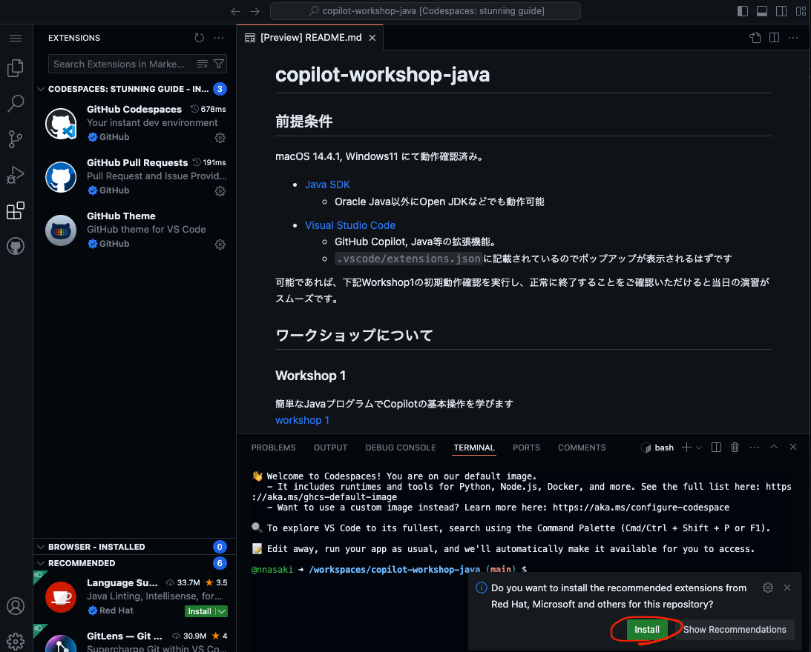
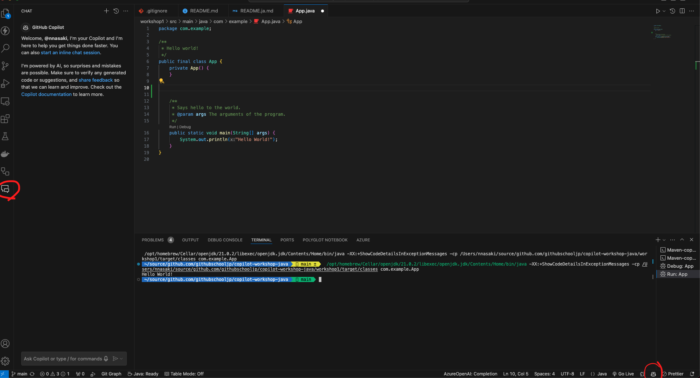

# Copilot Workshop with Python
- [日本語版](README.ja.md)
- [한국어판](README.kr.md)

## Prerequisites
Please prepare the following environment. We have confirmed operation on macOS 14.4.1 and Windows11. The exercises will be conducted in Visual Studio Code. You can participate with other IDEs that support GitHub Copilot, but there may be questions we cannot answer.

- [Python](https://www.python.org/)
  - Version: Python 3.12
- [Visual Studio Code](https://code.visualstudio.com/download)
  - Extensions such as GitHub Copilot.
  - Should be listed in `.vscode/extensions.json`, so a popup should appear
  - 
  - Please confirm that the Copilot icon is displayed as shown below. Also, click the icon and confirm that it is `Status:Ready`.
  - 

## Operation check
Run `python3 --version` or `python --version` in the command prompt or terminal, and it should output something like `Python 3.12.3`

### Workshop 1
You will learn the basic operations of Copilot 
[workshop 1](workshop1/README.md)

### Workshop 2
Experience Copilot Chat 
[workshop 2](workshop2/README.md)

### Workshop 3
Develop an app with Python & Flask with the help of Copilot 
[workshop 3](workshop3/README.md)