# Getting started - スワッグ配布のアルゴリズムパズルを解く - Visual Studio Code

Welcome to GitHub Copilot!

意外と知られていないかもしれませんが、GitHub Copilotはアルゴリズムのパズルを解くのが得意です。このデモでは、GitHub Copilotが実際の問題（スワッグアイテムをロッカーに配布する）を解決するためにどのように役立ったかを紹介します。

こんな話があります。従業員への感謝の気持ちを込めて、さまざまなスワッグアイテムを配布することになりました。現在、タンバー、バッグパック、サイズ違いのシャツ、サイズ違いのパーカーなどがあります。問題は、これらをロッカーに設置し、各自がロッカーに近づいてパスコードを入力し、スワッグアイテムの束を取り出せるようなセルフサービス方式にしたいということです。問題は、各ロッカーのパスコードがユニークでなければならないということです。そこで、各ロッカーがユニークなパスコードを持つように、これらのスワッグ・アイテムをロッカーに分配する方法を考えなければなりません。

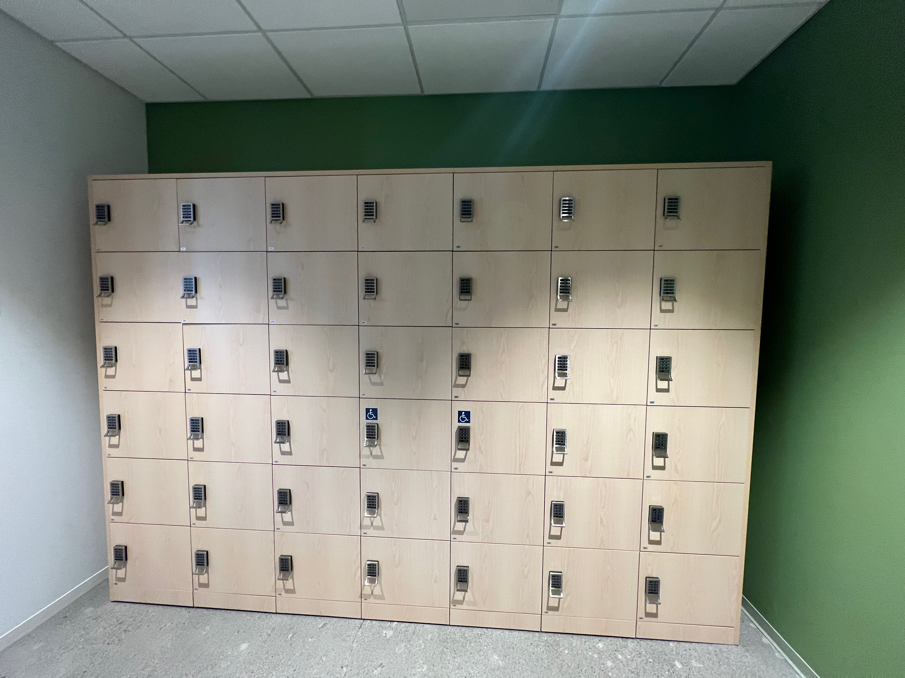

## 前提条件

- [Copilot Extension for Visual Studio Code](https://code.visualstudio.com/download)
- Python

## Steps

この問題を解決するために、一歩ずつ進んでいきます。

### Step 1: 新規ファイルの作成

まず、Visual Studio Codeで新規ファイルを作成しましょう。ユニークな名前のフォルダーの中に入れるのもいいでしょう。

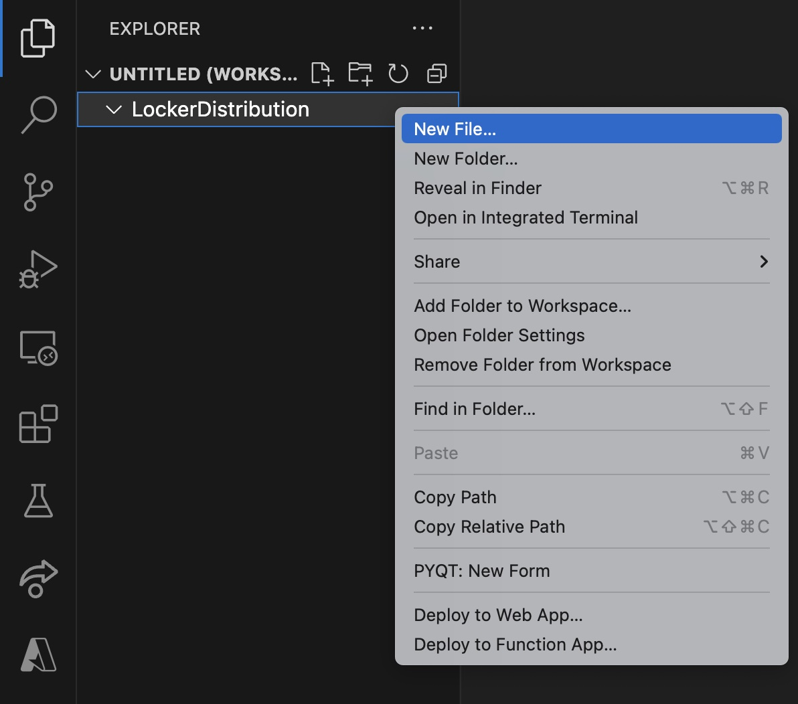

ここではこのファイルを `locker-distribution.py` と名付けましたが、好きなように指定いただいて構わないです。その新しいファイルから、ハッシュ記号で始まるコメントを入力し始めることができます。Copilotはコメント、関数名、以前のコンテキストなどに基づいて提案することができます。

### Step 2: コメントを入力して、Copilotにコードスニペットを提案させます

先に問題を解決しようとしているので、下記のようなコメントを入力してみましょう。

```python
# Generate a N x M matrix where each cell represents a locker where N is a number of rows and M is number of columns.
# Each cell should have a randomly generated integer locker code with length 4.
```

```python
# 各セルがロッカーを表すN×Mの行列を生成する(Nは行数、Mは列数)。
# 各セルは長さ4の整数ロッカーコードをランダムに生成する必要がある.
```

説明は多いほどよいです。Copilotはあなたがやろうとしていることを理解しようとし、コードスニペットを提案します。

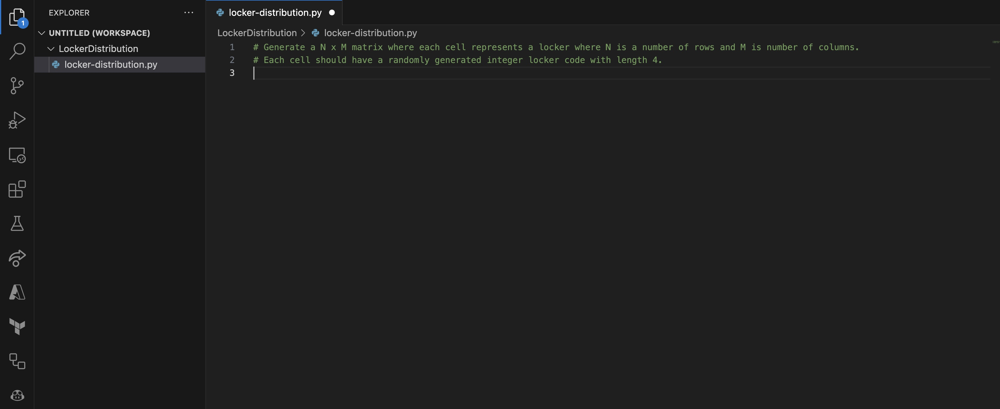

すると、Copilotがコード・スニペットを提案してきました。`Tab`キーを押して提案を受け入れることができます。また、`Ctrl+Space`キーを押すと、さらに多くの提案を見ることができます。（複数提案がある場合）

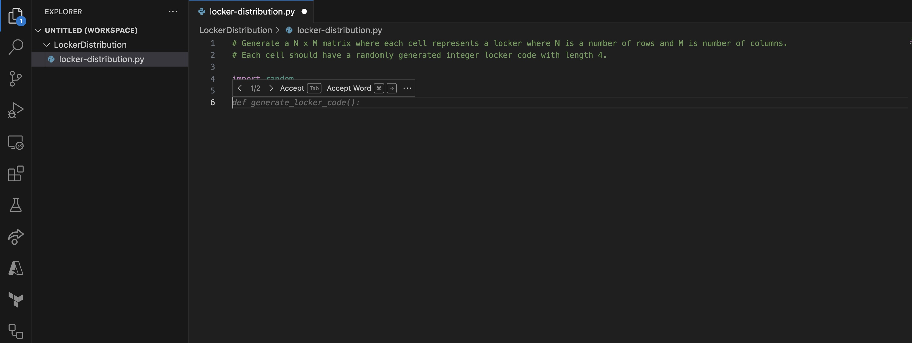

エディターの右下にあるCopilotアイコンが回転していることに気づいたかもしれません。これは、Copilotがあなたがやろうとしていることを理解しようと懸命に働いていて、より多くのコードスニペットを提案してくることを意味します。

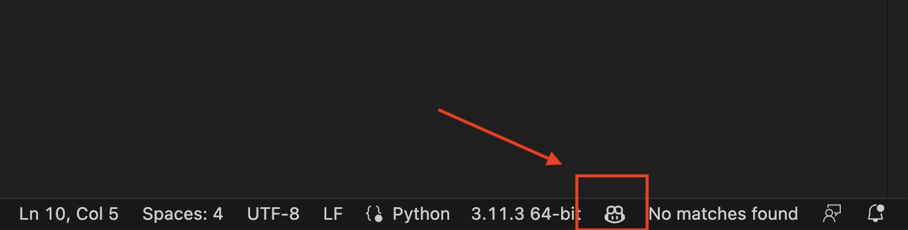

Enterを押しながらタブを押して、提案を受け入れる必要があるかもしれません。完成したコードはこのようになるかもしれませんが、結果は異なるかもしれません。これは、Copilotが学習して動的な結果を生成できるためです。

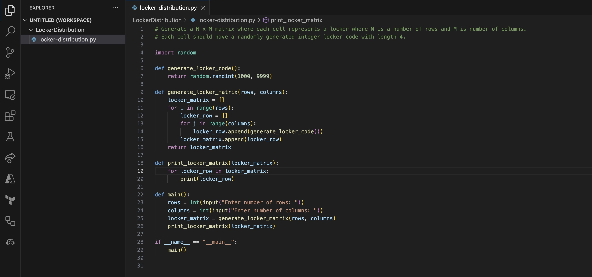

### Step 3: コパイロットのアウトプットを見る

では、Copilotからのプロセスを見てみましょう。上部メニューの**Terminal**をクリックし、**New Terminal**を選択します。エディターの下部に新しいターミナル・ウィンドウが開きます。

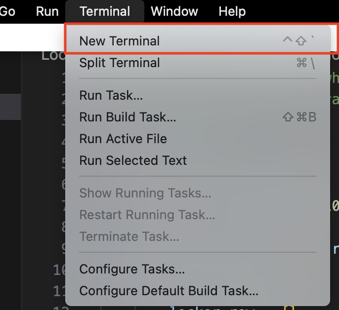

まず**OUTPUT**タブを選択しましょう。

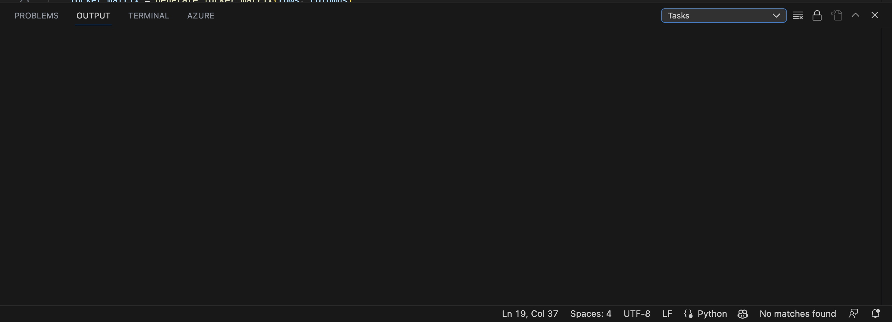

その後、ターミナルウィンドウのドロップダウンメニューをクリックし、**GitHub Copilot**を選択します。

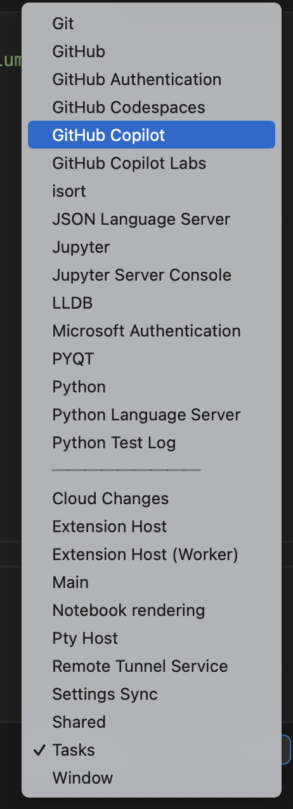

すると、Copilotからのテレメトリが表示されます。Copilotがバックグラウンドで何をしているかを見ることができ、Copilotが**考える**たびに更新されます。

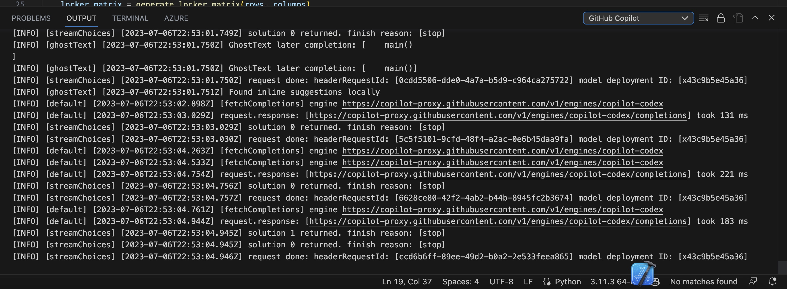


### Step 4: Pythonスクリプトの実行

最初のPythonの結果を検証してみよう。TERMINAL**タブをクリックします。

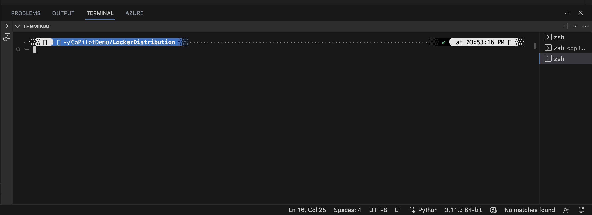

そして、`python locker-distribution.py`と入力してエンターキーを押してください。結果が表示されるます。（表示出力コードがなければ追加してください。）

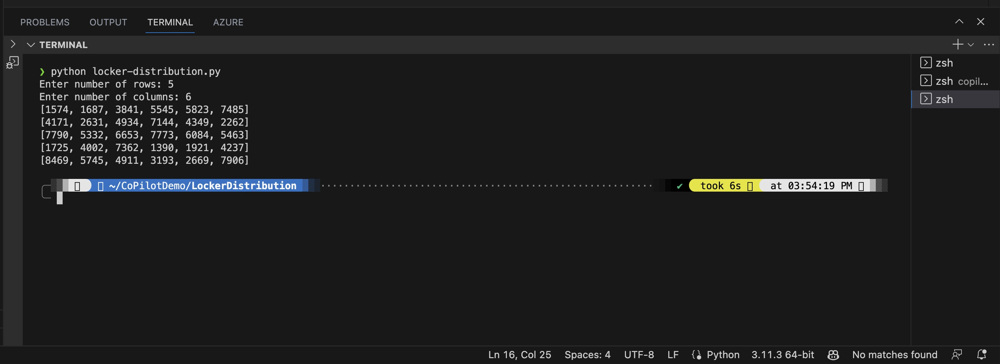

そして、これがフルのビューです。

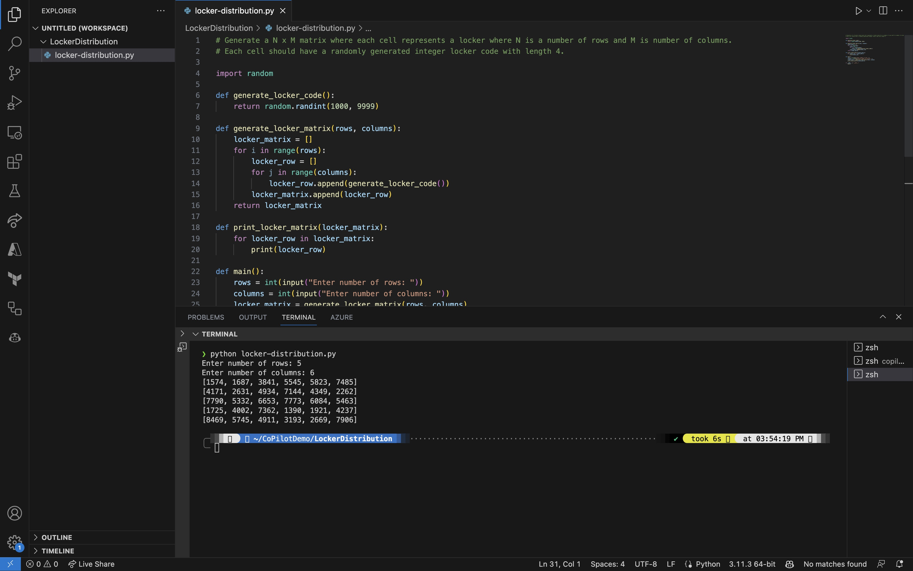

これで、少なくともロッカーごとにランダムなコードを生成するという当初の問題は解決しました。しかし、もしスワッグアイテムも配布したいとしたらどうだろう？

### Step 5: より複雑なロジックを扱うためにコードを修正する

より複雑なシナリオを処理するために、先ほどのロジックを変更します。コードを次のように変更してみましょう。

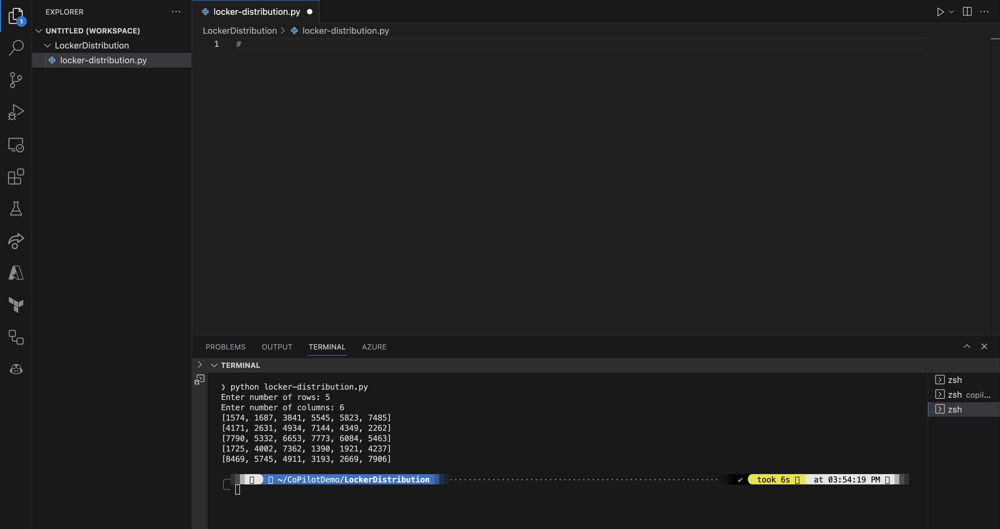

次に、できるだけ説明的に書く必要があります。例えば次のように入力してみます。

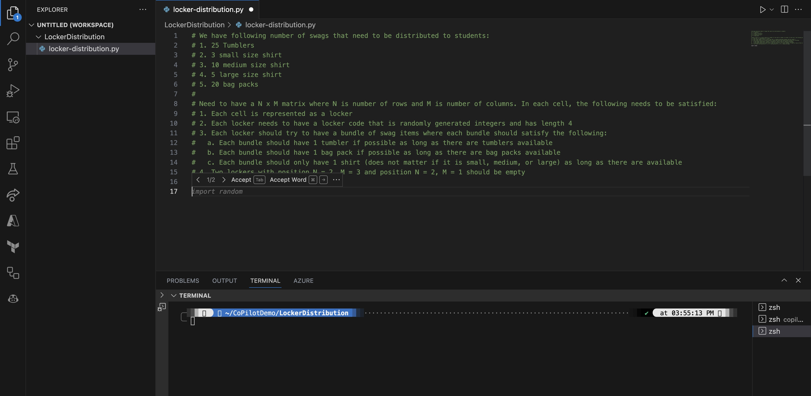

```python
# We have following number of swags that need to be distributed to students:
# 1. 25 Tumblers
# 2. 3 small size shirt
# 3. 10 medium size shirt
# 4. 5 large size shirt
# 5. 20 bag packs
# 
# Need to have a N x M matrix where N is number of rows and M is number of columns. In each cell, the following needs to be satisfied:
# 1. Each cell is represented as a locker
# 2. Each locker needs to have a locker code that is randomly generated integers and has length 4
# 3. Each locker should try to have a bundle of swag items where each bundle should satisfy the following:
#   a. Each bundle should have 1 tumbler if possible as long as there are tumblers available
#   b. Each bundle should have 1 bag pack if possible as long as there are bag packs available
#   c. Each bundle should only have 1 shirt (does not matter if it is small, medium, or large) as long as there are available
# 4. Two lockers with position N = 2, M = 3 and position N = 2, M = 1 should be empty
```

```python
# 以下の数のスワッグを生徒に配布する必要がある：
# 1. タンブラー 25個
# 2. シャツ Sサイズ 3枚
# 3. シャツ Mサイズシャツ　10枚
# 4. シャツ Lサイズ 5枚
# 5. バッグパック 20個
# 
# ここで、Nは行数、Mは列数である。各セルにおいて、以下を満たす必要がある：
# 1. 各セルはロッカーとして表現される
# 2. 各ロッカーは、ランダムに生成された整数で長さ4のロッカーコードを持つ必要がある。
# 3. 各ロッカーはスワッグアイテムの束を持つようにし、各束は以下を満たすようにする：
# a. 可能である限り、各タンブラーには 1個のタンブラーが含まれているべきである。
# b. 可能であれば、バッグパックが用意されている限り、各 束にはバッグパックが1つずつ入っているべきである。
# c. 可能な限り、各バンドルはシャツ1枚（S、M、Lは問わない） のみであるべきである。
# 4. N=2、M=3およびN=2、M=1の2つのロッカーは空であるべきである。
```

入力すると、Copilotはあなたがやろうとしていることを理解しようとし、コード・スニペットを提案する。しかし、このように錯覚もします。

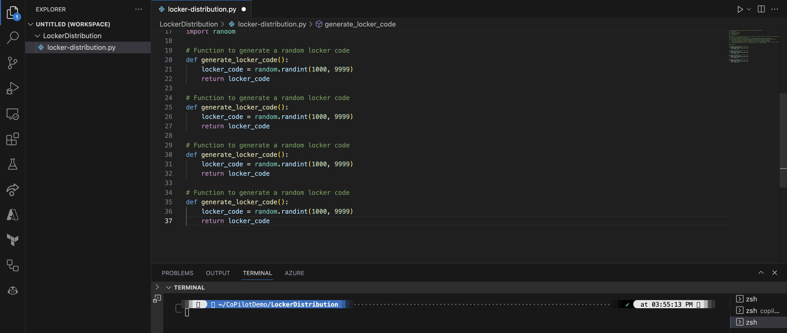

その提案をまた受けることもできますが、何度も繰り返される可能性もあります。

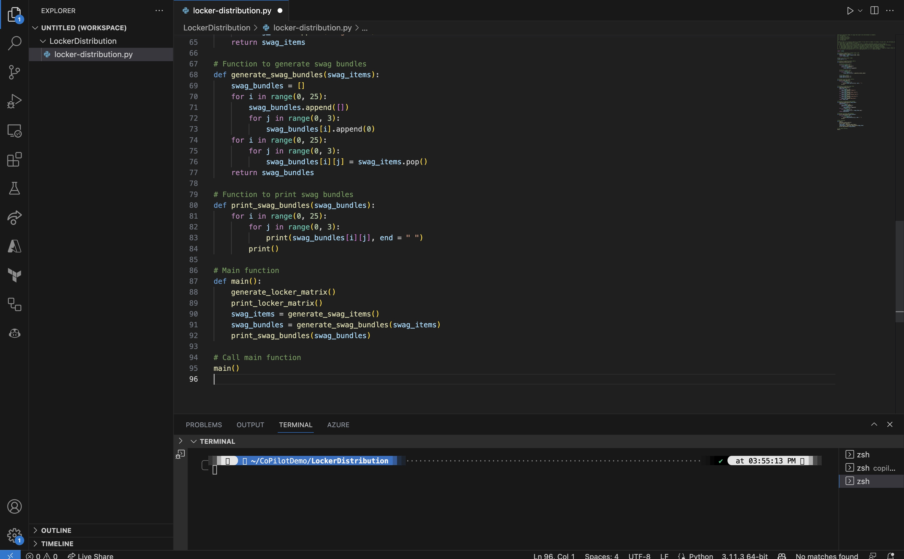

もちろんいつでもエラーに遭遇する可能性はあります。

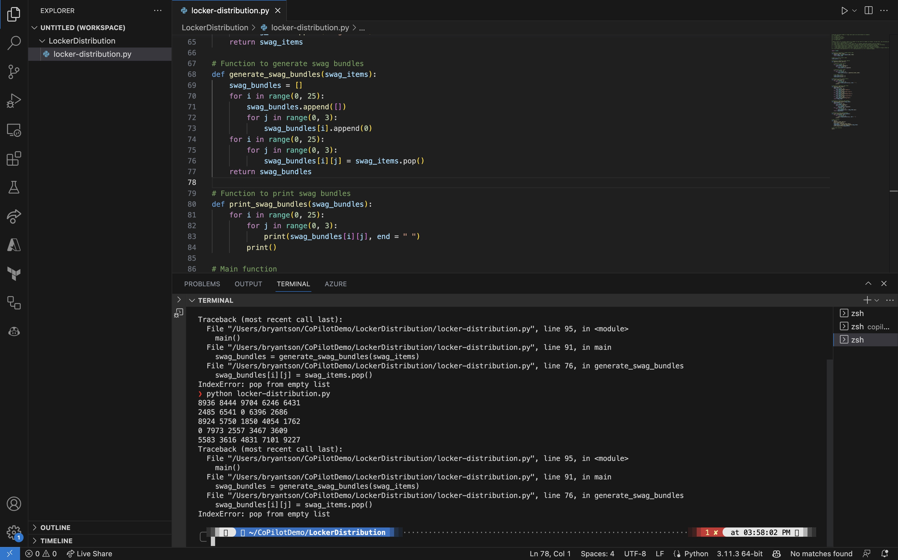


エラーは想定内ですし、覚えておいてほしいのは：「あなたがメインのパイロットで、コパイロットは仲間」ということです。コードを上書きしたり変更したりすることはいつでもできます。
