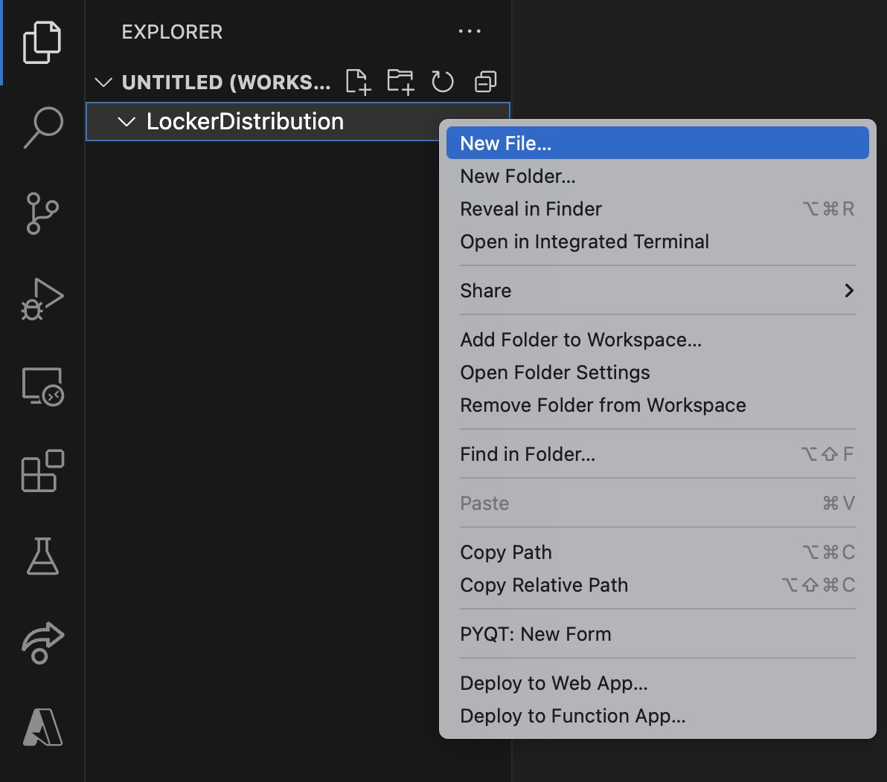
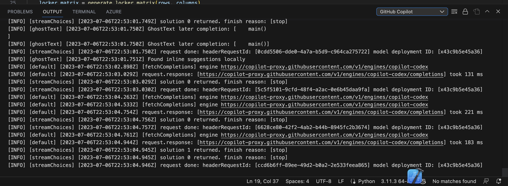
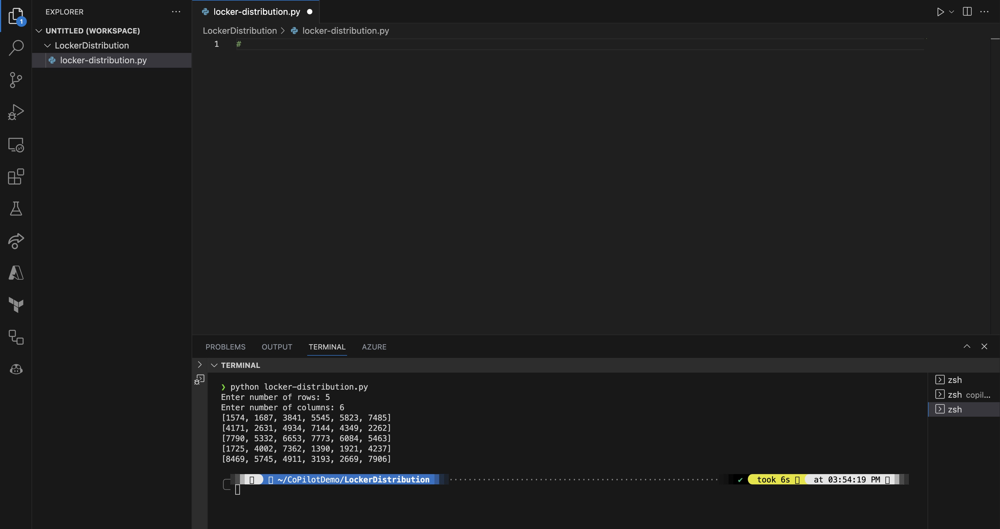
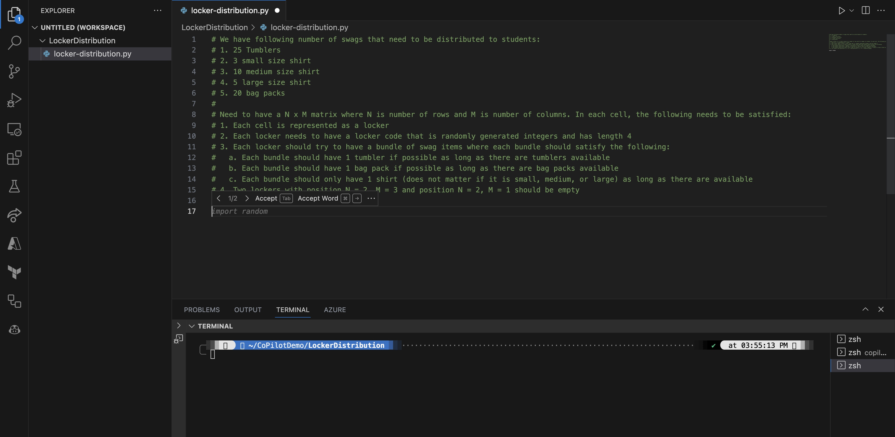
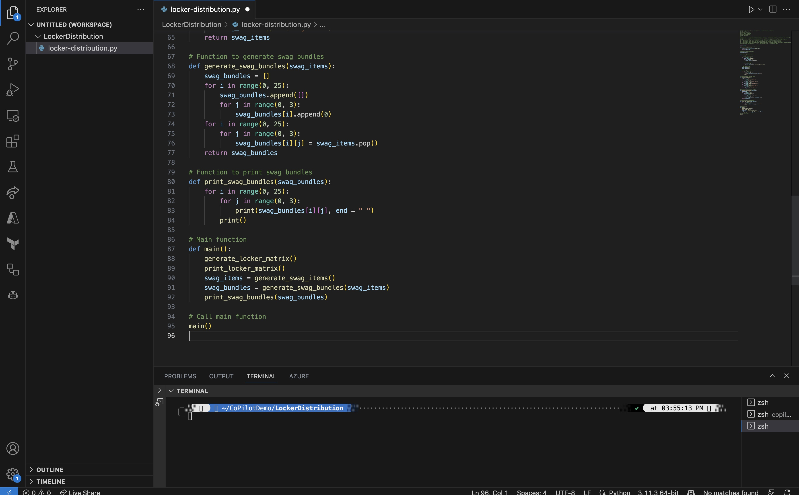
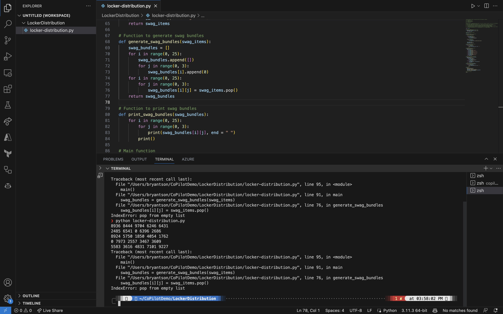

# 시작하기 - 스웩 아이템 배포의 알고리즘 퍼즐 풀기 - Visual Studio Code

깃허브 코파일럿에 오신 것을 환영합니다!

그다지 놀랍지 않게도 GitHub Copilot은 알고리즘 퍼즐을 푸는 데 매우 능숙합니다. 이 데모에서는 실제 문제인 사물함에 스웩 아이템을 배포하는 데 GitHub Copilot이 실제로 어떻게 도움이 되는지 보여드리겠습니다.

여기 스토리가 있습니다. 저희는 감사의 의미로 일부 직원에게 여러 가지 스웩 아이템을 배포하고 있습니다. 지금 우리 회사에는 다양한 사이즈의 티셔츠, 가방 팩, 다양한 사이즈의 후드티가 있습니다. 문제는 이 물품들을 사물함에 넣어 각 직원이 사물함에 가서 비밀번호를 입력하고 스웩 아이템을 꺼낼 수 있는 일종의 셀프 서비스 기반이 되기를 원한다는 것입니다. 문제는 각 사물함의 비밀번호가 4자리로 구성된 고유한 것이어야 한다는 것입니다. 따라서 각 사물함이 고유한 비밀번호를 갖도록 이 스웩 아이템을 사물함에 배포하는 방법을 찾아야 합니다.


## 단계

이 문제를 해결하기 위해 한 번에 한 단계씩 살펴봅시다.

### 1단계: 새 파일 만들기

먼저 Visual Studio Code에서 새 파일을 만들어 보겠습니다. 고유한 이름의 폴더 안에 넣는 것도 좋습니다.



이 파일의 이름은 `locker-distribution.py`로 지었지만 원하는 대로 불러도 됩니다. 새 파일에서 해시 기호로 시작하는 코멘트를 입력할 수 있습니다. 코파일럿은 코멘트, 함수 이름, 이전 컨텍스트 등을 기반으로 제안할 수 있습니다.

### 2단계: 코멘트를 입력하여 Copilot이 코드 스니펫을 제안하도록 하기

앞서 문제를 해결하려고 했기 때문에 이렇게 입력했습니다.

```python
# # 각 셀이 로커를 나타내는 N x M 행렬을 생성하고, 여기서 N은 행 수, M은 열 수입니다.
# 각 셀에는 길이가 4인 무작위로 생성된 정수 로커 코드가 있어야 합니다.
```

설명이 많을수록 좋습니다. 코파일럿은 사용자가 무엇을 하려는지 이해하려고 노력하며 코드 스니펫을 제안합니다.


보시다시피 코파일럿이 코드 스니펫을 제안했습니다. Tab` 키를 눌러 제안을 수락할 수 있습니다. 더 많은 제안을 보려면 `Ctrl+Space`를 눌러도 됩니다.


눈치 빠른 분이라면 에디터 오른쪽 하단의 코파일럿 아이콘이 회전하는 것을 보셨을 것입니다. 이는 코파일럿이 사용자가 하려는 작업을 이해하기 위해 열심히 작업 중이며 더 많은 코드 스니펫을 제안한다는 뜻입니다.


제안을 수락하려면 계속 입력하고 탭을 눌러야 할 수도 있습니다. 완성된 코드는 다음과 같을 수 있지만 결과는 다를 수 있습니다. 코파일럿이 학습 중이며 동적인 결과를 생성할 수 있기 때문입니다.


### 3단계: Copilot의 일부 결과 보기

이제 Copilot에서 나오는 몇 가지 프로세스를 확인해 보겠습니다. 상단 메뉴에서 **터미널**을 클릭하고 **새 터미널**을 선택합니다. 그러면 에디터 하단에 새 터미널 창이 열립니다.


먼저 **OUTPUT** 탭을 선택하겠습니다.


그 후 터미널 창에서 드롭다운 메뉴를 클릭하고 **GitHub Copilot**을 선택합니다.


그러면 Copilot에서 몇 가지 원격 측정값을 볼 수 있습니다. Copilot이 백그라운드에서 무엇을 하고 있는지 확인할 수 있으며, Copilot이 **생각**할 때마다 업데이트됩니다.



### Step 4: Run Python script

첫 번째 Python 결과를 확인해 보겠습니다. 터미널** 탭을 클릭합니다.


그런 다음 `python locker-distribution.py`를 입력하고 Enter 키를 누릅니다. 결과가 표시될 것입니다.


그리고 전체 보기에서 이렇게 표시되어야 합니다.


이렇게 하면 최소한 각 사물함에 대해 무작위 코드를 생성하는 초기 문제는 해결되었습니다. 하지만 스웩 아이템도 배포하려면 어떻게 해야 할까요?

### Step 5: Modify the code to handle more complicated logic

더 복잡한 시나리오를 처리하기 위해 앞서의 로직을 변경하겠습니다. 코드를 다음과 같이 변경해 보겠습니다.



다음으로 가능한 한 설명적으로 작성해야 합니다. 저는 이렇게 입력했습니다.



```python
# 학생들에게 배포해야 할 스웩의 개수는 다음과 같습니다:
# 1. 텀블러 25개
# 2. 스몰 사이즈 셔츠 3장
# 3. 미디엄 사이즈 셔츠 10장
# 4. 라지 사이즈 셔츠 5개
# 5. 가방 팩 20개
# 
# N x M 행렬이 필요합니다. 여기서 N은 행 수, M은 열 수입니다. 각 셀에서 다음을 충족해야 합니다:
# 1. 각 셀은 사물함으로 표현됩니다.
# 2. 각 사물함에는 무작위로 생성된 정수이고 길이가 4인 사물함 코드가 있어야 합니다.
# 3. 각 사물함에는 스웩 아이템 번들이 있어야 하며, 각 번들은 다음을 충족해야 합니다:
# 가. 각 번들에는 가능한 한 텀블러 1개가 있어야 하며, 텀블러가 있는 경우 1개만 포함해야 합니다.
# b. 각 번들에는 사용 가능한 가방 팩이 있는 한 가능한 경우 가방 팩 1개가 포함되어야 합니다.
# c. 각 번들에는 사용 가능한 한 셔츠 1 개 (소형, 중형 또는 대형 여부는 중요하지 않음) 만 있어야합니다.
# 4. 위치 N = 2, M = 3 및 위치 N = 2, M = 1의 사물함 두 개는 비어 있어야 합니다.
```

입력하고 입력하면 Copilot은 사용자가 무엇을 하려는지 이해하려고 노력하며 코드 조각을 제안합니다. 하지만 다음과 같이 환각을 표시하기도 합니다.


제안을 다시 받아볼 수는 있지만 이런 일이 계속 반복될 수 있습니다.



물론 언제든지 오류가 발생할 수도 있습니다. 




하지만 괜찮을 것입니다. 오류는 예상되는 일이며, 기억하세요. 여러분은 메인 파일럿이고 부조종사는 동반자입니다. 언제든지 코드를 재정의하고 변경할 수 있습니다.